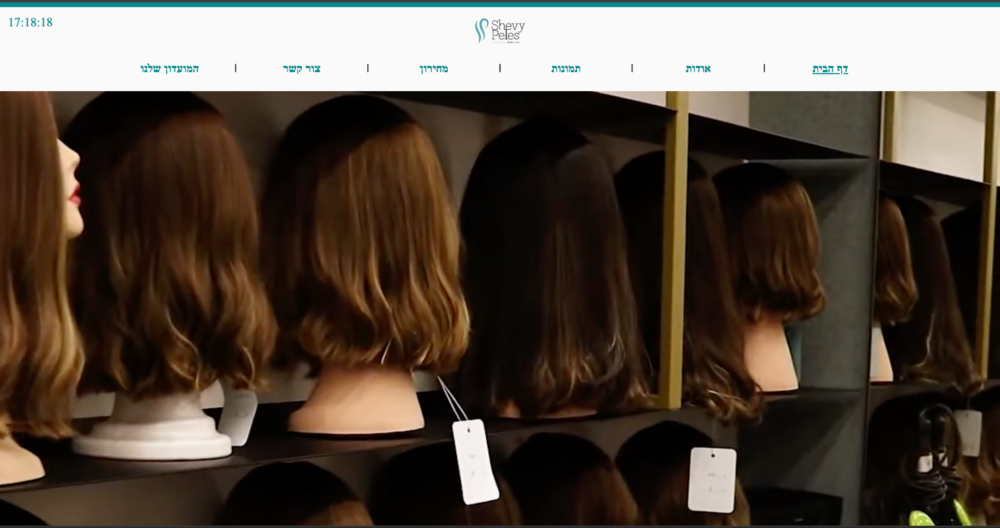
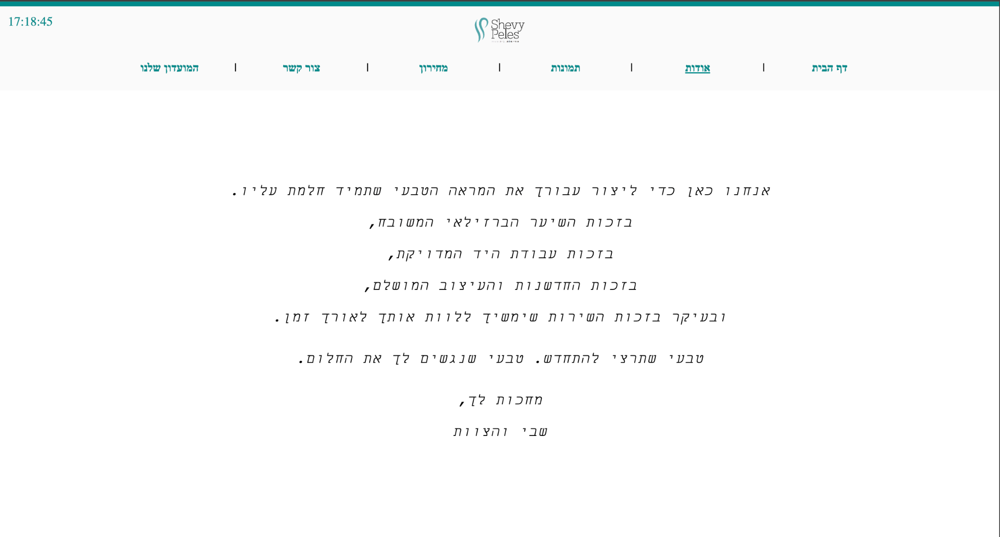

# High School Project – Wig Salon Showcase Website (2022)

This website was developed as part of my first year in the computer science program during high school.  
It is a **branding showcase site** for a wig salon, built using **ASP.NET Web Forms (C#)**.

## ✨ Project Purpose

The site is designed to reflect the atmosphere and values of the wig salon.  
It features:

- A **home page** with a short introduction to the salon
- A **gallery of wigs** showcasing styles and quality
- Informational **"About", "Price list", and "Contact"** pages (non-functional)
- Hebrew layout and styling tailored for local audience
- Clean, aesthetic, and responsive design with branding in mind

📌 This is a **static site** – it does not include shopping, form submissions, or backend logic.

## 🖼 Screenshots

  

  

## 🗃 Tech Stack

- ASP.NET Web Forms (C#)
- HTML, CSS
- SQL Server database (not used for interactivity in this specific version)
- Visual Studio environment

## 💬 Notes

This project reflects my early experience with web development and design.  
Although it’s simple, it taught me the foundations of:
- Working with ASP.NET and web technologies
- Managing project structure and configuration
- Designing layout and navigation for user experience

I’m proud of it as my first real software project ❤️

---

Want to view the live version or see more? Feel free to contact me via [GitHub](https://github.com/noa4970).
